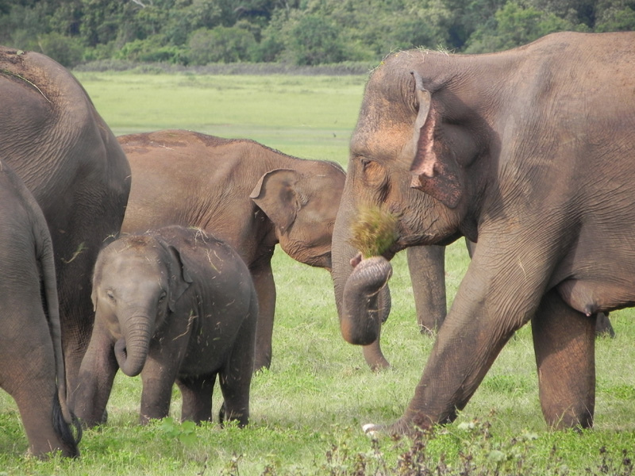

[English](README.md)

### REILX/ImageText-Question-answer-pairs-58K-Claude-3.5-Sonnnet
从VisualGenome数据集V1.2中随机抽取21717张图片，利用Claude-3-opus-20240229和Claude-3-sonnet-20240620两个模型生成了总计58312个问答对，每张图片约3个问答，其中必有一个关于图像细节的问答。Claude-3-opus-20240229模型贡献了约3,028个问答对，而Claude-3-sonnet-20240620模型则生成了剩余的问答对。


### 问答对生成代码
####  
**GenerateQA.py** 从Visual Genome数据集中随机选择图片，并利用Claude AI模型生成相关的问题和答案对。

1. 从指定的源目录随机选择21717张图片。
2. 将每张图片转换为base64编码。
3. 使用Claude-3-sonnet-20240620模型API，为每张图片生成至少3个问答对。
4. 第一个问题总是关于图片的整体描述和细节。
5. 处理API返回的JSON数据，修复可能的格式问题。


### 图像问答对示例


```json
[
    {
        "image": "107995.jpg",
        "conversations": [
            {
                "from": "human",
                "value": "<image>\n请详细描述这张图片中的场景,包括可见的动物、它们的行为以及周围的环境。"
            },
            {
                "from": "gpt",
                "value": "这张图片展示了一群大象在草地上活动的场景。图中可见至少4只大象,其中包括成年大象和幼象。大象们正在一片开阔的绿色草地上悠闲地行走和进食。最前方的一只大象正用长鼻子抓取草地上的植物,准备送入口中。幼象紧跟在成年大象身边,看起来很安全。背景是郁郁葱葱的树林或灌木丛,为整个场景增添了自然和野性的氛围。这是一幅典型的非洲草原或野生动物保护区的景象。"
            }
        ],
        "id": "107995"
    },
    {
        "image": "107995.jpg",
        "conversations": [
            {
                "from": "human",
                "value": "<image>\n从这张图片中,我们可以推断出大象的哪些社会行为特征?"
            },
            {
                "from": "gpt",
                "value": "从这张图片中,我们可以推断出大象的几个社会行为特征:\n1. 群居性:图中显示多只大象聚集在一起,说明大象是群居动物。\n2. 家族结构:可以看到成年大象和幼象在一起,表明大象有家族结构,成年大象会照顾和保护幼象。\n3. 协作觅食:大象们共同在草地上觅食,显示了它们在寻找食物时的协作行为。\n4. 互相关爱:成年大象和幼象靠得很近,体现了大象家族成员之间的亲密关系和互相关爱。\n5. 分工:成年大象似乎在带领和保护幼象,说明大象群体中可能存在分工。"
            }
        ],
        "id": "107995"
    },
    {
        "image": "107995.jpg",
        "conversations": [
            {
                "from": "human",
                "value": "<image>\n根据图片中大象的外貌特征,你能推断出这可能是哪种大象吗?为什么?"
            },
            {
                "from": "gpt",
                "value": "根据图片中大象的外貌特征,这些很可能是非洲象,具体来说是非洲草原象。理由如下:\n\n1. 体型:图中的大象体型巨大,非洲象是世界上最大的陆地动物。\n2. 耳朵:虽然图片不是特写,但可以看出大象的耳朵较大,这是非洲象的典型特征。非洲象的耳朵比亚洲象大得多。\n3. 皮肤颜色:大象呈现灰褐色,这是非洲象的常见肤色。\n4. 环境:背景是开阔的草原和远处的树林,这符合非洲草原象的栖息地特征。\n5. 象牙:虽然不是所有大象都清晰可见,但似乎可以看到一些大象有象牙,非洲象的象牙通常比亚洲象更明显。\n\n综上所述,根据体型、耳朵大小、肤色、环境和可能的象牙特征,这些大象很可能是非洲草原象。"
            }
        ],
        "id": "107995"
    },
    {
        "image": "107995.jpg",
        "conversations": [
            {
                "from": "human",
                "value": "<image>\n大象用鼻子抓取食物的行为有什么特殊之处?这种行为对大象的生存有何重要性?"
            },
            {
                "from": "gpt",
                "value": "大象用鼻子抓取食物的行为有许多特殊之处,对它们的生存极为重要:\n\n1. 灵活性:大象的鼻子非常灵活,可以精确地抓取各种大小的食物,从草到树枝都能处理。\n\n2. 力量:鼻子不仅灵活,还非常有力,能够拔出植物或折断树枝。\n\n3. 感知能力:鼻子末端有敏感的触觉,能够感知食物的质地和适口性。\n\n4. 多功能性:鼻子可以用来抓取、嗅闻、触摸和运送食物到口中。\n\n5. 效率:长鼻子让大象能够在不弯腰的情况下取食地面的植物,提高了觅食效率。\n\n6. 水分获取:鼻子还可以用来吸水和喷水,帮助大象在干旱环境中生存。\n\n7. 适应性:这种进食方式让大象能够适应多种环境,从草原到森林都能获取食物。\n\n这种行为对大象的生存至关重要,因为它们需要每天消耗大量食物来维持庞大的体型。鼻子的多功能性让大象能够高效地获取多样化的食物,适应不同的环境,从而在各种生态系统中生存和繁衍。"
            }
        ],
        "id": "107995"
    }
]
```


图像及QA文本下载地址可访问huggingface链接 [REILX/ImageText-Question-answer-pairs-58K-Claude-3.5-Sonnnet](https://huggingface.co/datasets/REILX/ImageText-Question-answer-pairs-58K-Claude-3.5-Sonnnet)。
